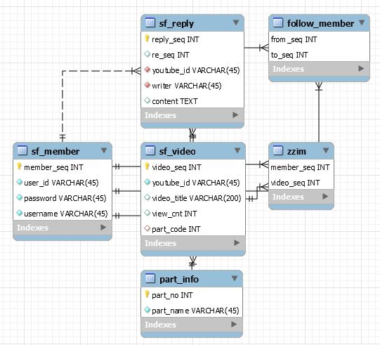
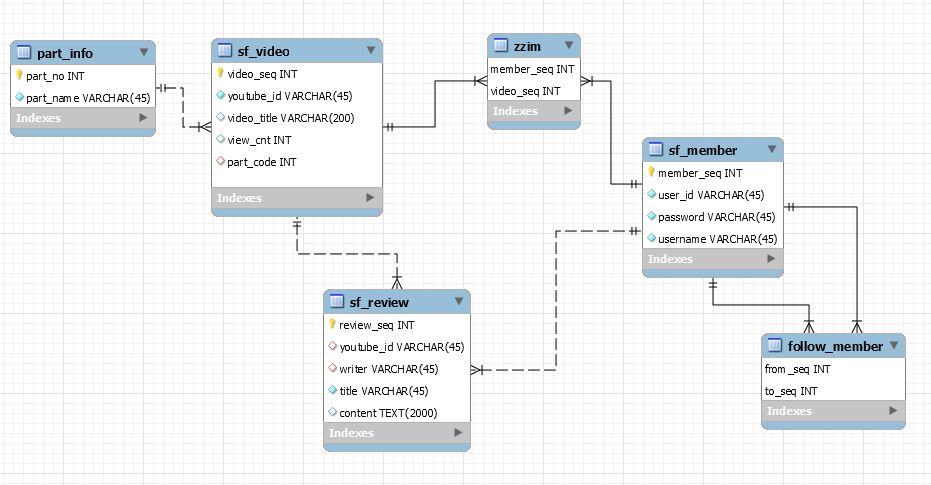

## SSAFIT

- **220521 작업내역**
  - **Spring update**
    - 찜하기 post/delete에서 list를 반환하도록 수정
  - **Vue update**
    - 영상 detail에서 찜하기 기능 추가. 이미 찜된 영상이면 눌렀을때 취소되도록 기능
    - sidebar 기능 처럼 만들어서 목록까지 노출이 되나, block 설정이 먹어서 메인 섹션이 클릭이 되지 않음..
    - 

---

- **220520 작업내역**
  - **Spring update**

  - **Vue update**
    - 댓글 수정 기능 구현
    - 대댓글 기능 추가
    - MyPage 기능 컴포넌트 분리,
    - headerNav 상단고정,
    - 모든 범위에서 스크롤바 보이지 않도록 수정
    - 내정보 > 정보수정 구현중
    - 팔로우 리스트에서 다른사람 상세보기 이동
    - 간단한 CSS 적용, 벡터 로고, 배너 등..          
    -           

---

- **220519 작업내역**
  - **Spring update**
    - reply api 반환타입 및 응답코드 변경(댓글 실시간 변경을 위해)
    - reply xml 최근 댓글이 위로 올라오도록 변경
  - **Vue update**
    - 비디오 리스트 페이지 구현(전체, 부위별)
    - 비디오 디테일 페이지 구현(영상과 댓글 확인가능)
    - 비디오 댓글 기능 구현
      - 본인의 댓글만 삭제 가능
      - 수정기능(구현 예정)
      - 로그인을 안하면 댓글 작성 불가
    - api 디렉토리 구조 변경
      - api > index.js에서 axios를 생성해서 member.js 및 video.js로 상속하여 기능 모듈화      
    - join 회원가입 기능 구현
      - userId입력폼을 벗어날때 중복검사(비동기 요청) 실시, 입력값이 없으면 아이디 입력폼으로 포커스 이동
      - userId 중복여부, pass재확인 여부, username중복여부 모두 true값이어야 api에 insert요청 실시
      - 기능 구현하려는 부분 : 동적인 입력폼으로 엔터나 탭키에 반응해서 다음 자동이동 되는 기능(disabled로 막는 기능도 넣어놔서 수월하지 않음)
    - MyPage 기능 구현 중
      - 멤버(followList, leadList), 영상(zzimList)를 반환하여 my page에서 볼 수 있도록 구현중. data 요청 확인, table배치중
      - 팔로우한 사람 버튼 누르면 해당 인원의 상세보기로 넘어가는 것 구현예정

--------------

- **220518 작업내역**

  - Spring update
    - member정보 수정,삭제 시 토큰에 저장된 id와 직접 비교하여 동일하면 삭제하도록하여 비정상 접근 방지    
    - **video -> zzim** 기능 추가
      - video에서 member와 복합되는 zzim기능 추가, member의 userId를 받아서 접근한다.
    - review -> reply로 변경
      - 기존 review 기능(create, delete, list)에 update기능 추가  
  - Vue update
    - 테스트를 위한 HeaderNav구성(메인-video, 로그인, 회원가입x) / (로그아웃, 마이페이지x) 
    - **login기능** 구현 완료
      - DB에 저장된 test ID를 기반으로 로그인 기능 구현, 쿠키 저장을 통한 아이디 저장 버튼 구현, 쿠키에 savedId키워드로 value값이 있으면 기입되어있게 구현
      - 로그인 시 Spring에서 생성된 auth-token과 logonMember 정보를 받아와서 sessionStorage와 router.state에 저장하도록 구현,
      - 사용자에게는 로그인된 본인의 member 정보를 줘도 되지 않을까 하는 부분을 생각해봐야 할 것 같음.  
  - Database update
    - **SQL Init v2**
      - review -> reply 리플형식으로 제목없이 내용으로 출력
      - reply_seq 외에 댓글의 대댓글 추후에 추가 할 것을 고려 re_seq 칼럼 추가
        - 영상에 달린 댓글은 디폴트로 0을 넣어서 관리
    - 

--------------

- **220517 작업내역**

  **기존 back-end 프로젝트 이식, 명칭 및 기능 변경**

    -  WebConfig, DBConfig, application.properties 세팅
       **github 브랜치 룰(토의)**
    -  master > (release) > develop > feature/'기능' or '작업자명'
       - master : 오류 없이 정상작동 되는 상태의 프로젝트 원본, develop과 동일하지만, 안정된 코드만 포함
       - (release) : 프로젝트를 배포하기 위한 브랜치
       - develop : 브랜치를 분기하는 브랜치 지점, 기능 개발 후 병합하는 지점
       - feature/이름 : 실질적으로 기능을 개발하는 브랜치, 완료 혹은 저장 시 develop으로 병합
       - [브랜치 설명 참조 BLOG](https://gmlwjd9405.github.io/2018/05/11/types-of-git-branch.html)
    -  일일 작업은 develop(master)에서 feature브랜치를 생성해서 작업을 실시하고, 
    -  병합 시 원격 브랜치(origin/feature/---)에 푸시하고, develop으로 병합요청을 한다.
    -  병합 가능 여부를 확인하고, 본인이 승인한다.
    -  기능이 완전히 구현되어 master 브랜치 반영이 가능하면 전체 병합을 한다.
    -  배포는 하지 않으므로 release는 사용하지 않는다.
    -  병합 시 오류가 발생하면 중복 수정된 내용을 조정하고, 
    -  만약, develop 브랜치 상태에서 프로젝트가 실행이 되지 않으면, 실행이 가능한 master브랜치로 초기화한다.
       **SpringBoot 작업내역**
  -  Member 관련 기능 구현, sql 수정, mapper 세팅완료
     - ApiMemberController 기능 구현
       - JWT를 이용한 login 기능 구현( 미완 : UserNotFoundEx, PWIncorrectEx 기능이 미작동 다르게 캐치됨.) 
       - GetMember 개인상세 정보 불러오기, 내가 follow한 목록, 나를 follow한 목록 불러오기 완료(토큰 필요)
       - Join 기능 구현, userId, password, username을 받고, 성공 시 CREATED, sql에 id중복시 CONFLICT상태값 반환 
       - update 기능 구현, password와 username만 수정 가능(토큰 필요)
       - delete 기능 구현, userId 기준으로 삭제(토큰 필요, 토큰과 호출된 userId 맞는 지 비교 기능 추가예정)
       - follow/unfollow 기능 구현 로그인 아이디는 헤더 토큰으로 식별, 타겟 ID는 url로 요청
  -  Video 관련 기능 구현,
     - list 기능 구현 , DB에 있는 모든 영상 정보 불러오기, key값을 받아 일치하는 제목 검색해서 불러오기, partCode를 받아 같은 카테고리의 운동영상 불러오기
     - detail 기능 구현, youtubeId를 받아 해당 영상 불러오기, 불러오면서 조회수 증가
  -  Review 관련 기능, sql 수정
     - review_seq auto-increment 설정
     - list 기능 구현, youtubeId를 받아 해당 영상에 달려있는 리뷰 가져오기,
     - create 기능 구현 review객체를 받아 review 생성
     - delete 기능 구현 , review_seq를 받아 해당 리뷰 삭제(토큰 필요, writer와 토큰이 맞는지 비교 기능 추가 예정?)

--------------

- **220516 작업내역**

  - 프로젝트 생성
    **vue 프로젝트 생성** ( vue create ssafit-vue )
    - dependencies
      - router ( vue add router )
      - vuex ( vue add vuex )
      - axios ( npm install axios )
      - bootstrap-vue (npm install vue bootstrap-vue bootstrap )
        - main.js 추가
          - import BootstrapVue from 'bootstrap-vue'
          - import 'bootstrap/dist/css/bootstrap.min.css'
          - import 'bootstrap-vue/dist/bootstrap-vue.css'
          - Vue.use(BootstrapVue)
            **springboot 프로젝트 생성** ( Spring starter project )
    - dependencies
      - MyBatis Framwork,
      - MySQL Driver,
      - Spring Boot DevTools,
      - Spring Web
        
        **MySQL database 구성** 
    - Table
      - SF_VIDEO - PART_NO
      - SF_MEMBER
      - SF_REVIEW
      - ZZIM
      - FOLLOW_MEMBER
